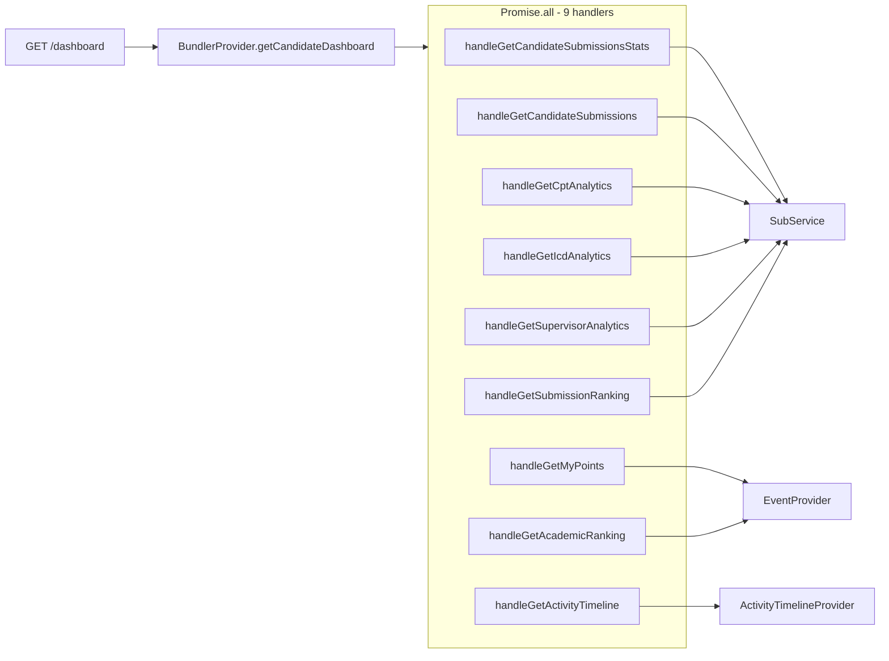

# GET /candidate/dashboard – Implementation review and optimization plan

**Overview:** Inspect and optimize GET /candidate/dashboard by eliminating duplicate DB work, fixing N+1 queries, and bounding result sets so the endpoint stays under the 15s timeout under 100 concurrent users.

---

## Current architecture

The dashboard runs **9 handlers in parallel**. Each handler runs independently; there is no shared per-request data. The response is ready when the **slowest** of the 9 finishes. Under load, connection pool contention and duplicate work make the whole request exceed the 15s timeout.

---

## Findings

### 1. Duplicate submission loads (critical)

Five of the nine handlers load **the same or overlapping submission data** for the same candidate:

| Handler | Provider method | Service call | Relations |
|--------|------------------|--------------|-----------|
| Stats | getCandidateSubmissionsStats | getSubsByCandidateId | 8 relations |
| Submissions list | getCandidateSubmissions | getSubsByCandidateId | 8 relations |
| CPT analytics | getCptAnalytics | getSubsByCandidateIdAndStatus(approved) | 8 relations |
| ICD analytics | getIcdAnalytics | getSubsByCandidateIdAndStatus(approved) | 8 relations |
| Supervisor analytics | getSupervisorAnalytics | getSubsByCandidateIdAndStatus(approved) | 8 relations |

So **per dashboard request** we run up to **5 heavy submission queries** (same candidate, same 8 relations: candidate, calSurg, calSurg.hospital, calSurg.arabProc, supervisor, mainDiag, procCpts, icds). With 100 concurrent users this multiplies to hundreds of redundant queries and is a major cause of timeout.

- `src/bundler/bundler.provider.ts` (lines 89–116): builds `basePromises` with the five sub handlers and runs them in parallel.
- `src/sub/sub.provider.ts`: getCandidateSubmissionsStats (528), getCptAnalytics (556), getIcdAnalytics (586), getSupervisorAnalytics (638), getCandidateSubmissions (718) each call SubService separately.
- `src/sub/sub.service.ts`: getSubsByCandidateId (87) and getSubsByCandidateIdAndStatus (105) both use the same 8 relations and no `take`.

### 2. Unbounded submission result sets

- `src/sub/sub.service.ts`: `getSubsByCandidateId` and `getSubsByCandidateIdAndStatus` have **no `take`**. A candidate with many submissions causes one very large JOIN result per call and amplifies the cost of the duplicate loads above.

### 3. N+1 in submission ranking

- `src/sub/sub.provider.ts` (lines 690–698): `getSubmissionRanking` calls `getApprovedCountsPerCandidate` (1 query), then loops over `idsToFetch` (up to 11 IDs) and calls `this.candService.getCandById(id, dataSource)` for each. `src/cand/cand.service.ts` already has `getCandsByIds(ids, dataSource)` (lines 161–172); it is not used here.

### 4. N+1 in "my points" (event points)

- `src/event/event.provider.ts` (lines 454–468): `getCandidateEventPoints` calls `getAttendanceWithEventsForCandidate` (1 query), then for each unique `journalPresenterIds` calls `this.candService.getCandById(id, dataSource)` and for each unique `lectureConfPresenterIds` calls `this.supervisorService.getSupervisorById({ id }, dataSource)`. So N+M extra queries per request. There is no batch method for supervisors (only `getSupervisorById` in `src/supervisor/supervisor.provider.ts`).

### 5. Other handlers

- **Activity timeline**: Already bounded (`take: 50` on subs and attendances) in `src/activityTimeline/activityTimeline.provider.ts`. No change needed.
- **Academic ranking**: Already cached (TTL + coalescing) in EventService. No change needed for this plan.
- **getApprovedCountsPerCandidate**: Single aggregation (GROUP BY candDocId). Index on `submissions(subStatus, submissionType, candDocId)` would help; add if not present from existing migrations.

---

## Recommended optimizations

### A. Single submission load for the dashboard (high impact)

**Goal:** One submission fetch per dashboard request, then derive stats, submissions list, CPT, ICD, and supervisor analytics in memory.

- In `src/bundler/bundler.provider.ts` `getCandidateDashboard`:
  - Read `candidateId` and `role` from `res.locals.jwt` (same as sub/event controllers).
  - Call **once** `subProvider.getSubsByCandidateId(candidateId, dataSource)` (or a new method that applies a dashboard limit).
  - From the returned list: filter `approved = subs.filter(s => s.subStatus === 'approved')`.
  - Build the five sub-related results in parallel (no further DB for these):
    - **Stats**: from `subs` (count approved, rejected, pending, approvedAndPending).
    - **Submissions**: return `subs` (or mapped shape if needed).
    - **CPT analytics**: same logic as current `getCptAnalytics` but over `approved` (and role).
    - **ICD analytics**: same logic as current `getIcdAnalytics` but over `approved` (and role).
    - **Supervisor analytics**: same logic as current `getSupervisorAnalytics` but over `approved`.
- Add in `src/sub/sub.provider.ts` pure functions (or methods that accept `ISubDoc[]` and optional `role`):
  - `getCandidateSubmissionsStatsFromSubs(subs)`
  - `getCptAnalyticsFromSubs(approvedSubs, role)` (reuse existing role/label logic)
  - `getIcdAnalyticsFromSubs(approvedSubs, role)`
  - `getSupervisorAnalyticsFromSubs(approvedSubs)`
- Keep the other four handlers (handleGetMyPoints, handleGetActivityTimeline, handleGetSubmissionRanking, handleGetAcademicRanking) as-is for this step; they continue to be invoked via the same Promise.all with the new "from subs" results for the five sub pieces.

**Result:** 5 submission queries per request reduced to 1.

### B. Fix N+1 in submission ranking (low effort)

- In `src/sub/sub.provider.ts` `getSubmissionRanking`, replace the loop that calls `getCandById` with:
  - `const candidates = await this.candService.getCandsByIds(idsToFetch, dataSource);`
  - Build `candidateMap` from the returned array (and handle missing IDs with defaults as today).

### C. Fix N+1 in getCandidateEventPoints (medium impact)

- **Candidates:** Replace the `for (const id of journalPresenterIds)` loop with a single `this.candService.getCandsByIds(Array.from(journalPresenterIds), dataSource)` and build the journal-presenter part of `presenterMap` from the result.
- **Supervisors:** Add `getSupervisorsByIds(ids: string[], dataSource: DataSource)` in `src/supervisor/supervisor.provider.ts` (and expose via SupervisorService if used through the service). In `getCandidateEventPoints`, call it once with `Array.from(lectureConfPresenterIds)` and build the lecture/conf presenter part of `presenterMap` from the result.

### D. Index for getApprovedCountsPerCandidate (optional but recommended)

- Ensure `submissions` has an index that supports the aggregation (e.g. `(subStatus, submissionType, candDocId)` or at least `candDocId`) so that `getApprovedCountsPerCandidate` does not do a full table scan. Add a migration if such an index is not already present from earlier work.

---

## Implementation order

1. **A – Single submission load**
2. **B – Submission ranking N+1** (use getCandsByIds).
3. **C – Event points N+1** (getCandsByIds + getSupervisorsByIds).
4. **D – Index** (if missing).

---

## Files to touch (summary)

| File | Changes |
|------|--------|
| `src/bundler/bundler.provider.ts` | In getCandidateDashboard: get candidateId/role from JWT; call subProvider.getSubsByCandidateId once; compute stats, submissions, cpt, icd, supervisor from that list; keep other 4 handlers as-is. |
| `src/sub/sub.provider.ts` | Add getCandidateSubmissionsStatsFromSubs, getCptAnalyticsFromSubs, getIcdAnalyticsFromSubs, getSupervisorAnalyticsFromSubs; in getSubmissionRanking use getCandsByIds instead of getCandById loop. |
| `src/event/event.provider.ts` | In getCandidateEventPoints: batch candidate lookups with getCandsByIds; batch supervisor lookups with new getSupervisorsByIds. |
| `src/supervisor/supervisor.provider.ts` | Add getSupervisorsByIds(ids, dataSource). |
| `src/supervisor/supervisor.service.ts` | Expose getSupervisorsByIds if EventProvider uses the service. |
| New migration (if needed) | Add index on submissions for (subStatus, submissionType, candDocId) or candDocId. |

---

## Risk and scope

- **Scope:** Only GET /candidate/dashboard and the sub/event/supervisor code paths used by it.
- **Compatibility:** Response shape of the dashboard (stats, submissions, cptAnalytics, icdAnalytics, supervisorAnalytics, etc.) must remain the same so the frontend does not need changes.
