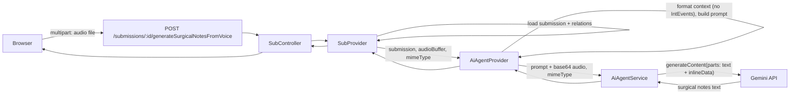

# Speech-to-text surgical notes in aiAgent

## Goal

- Add a **voice-based surgical notes** flow: the client sends an **audio file** plus a **submission id**; the backend sends to Gemini the **audio** and a **text prompt** containing the full submission structure (except intraoperative events) and cal_surg information; Gemini returns the surgical notes.
- Reuse existing aiAgent formatting and keep the new logic inside the aiAgent + sub layers. No DB or schema changes.

## Architecture

## Implementation

### 1. AiAgentService – multimodal Gemini call

**File:** [src/aiAgent/aiAgent.service.ts](src/aiAgent/aiAgent.service.ts)

- Add a new method, e.g. `generateContentFromAudioAndText(prompt: string, audioBase64: string, mimeType: string): Promise<string>`.
- Use the existing `this.genAI` instance and same model selection (e.g. `GEMINI_MODEL_NAME` / `gemini-2.5-flash`); ensure the chosen model supports audio (Gemini 1.5+ / 2.x do).
- Call `this.genAI.models.generateContent` with **multimodal contents**: one part `{ text: prompt }`, one part `{ inlineData: { mimeType, data: audioBase64 } }`. SDK accepts `Part[]` aggregated into a single user content (per README).
- Return `response.text` (the generated surgical notes). Handle errors and missing `response.text` as in `generateText`.

No new dependencies; same env vars (`GEMINI_API_KEY`, etc.).

### 2. AiAgent interfaces

**File:** [src/aiAgent/aiAgent.interface.ts](src/aiAgent/aiAgent.interface.ts)

- Add input type for the voice flow, e.g.:
  `IGenerateSurgicalNotesFromVoiceInput`: `{ submission: ISubDoc; audioBuffer: Buffer; mimeType: string }`
- Reuse existing `IGenerateSurgicalNotesResponse` (`{ surgicalNotes: string }`) for the return type.

### 3. AiAgentProvider – context prompt (no intraoperative events) + cal_surg

**File:** [src/aiAgent/aiAgent.provider.ts](src/aiAgent/aiAgent.provider.ts)

- Add **`generateSurgicalNotesFromVoice(input: IGenerateSurgicalNotesFromVoiceInput): Promise<IGenerateSurgicalNotesResponse>`**.
- Reuse **`formatSubmissionData(input.submission)`** to get `IFormattedSubmissionData`. When building the prompt, **exclude intraoperative events** (do not include `surgicalData.intraoperativeEvents` / `IntEvents` in the prompt text).
- Add **cal_surg "extra" fields** to the prompt: from `submission.procDocId` (the cal_surg entity) include at least `timeStamp`, `formLink`, `google_uid` if present (so the AI has procedure context). The rest of cal_surg (patient, hospital, procedure name, date) is already in `formatSubmissionData` via `procDocId`.
- Build a **single text prompt** that:
  - States that the attached audio is the surgeon's dictation and the following is the case context.
  - Includes the full formatted submission structure (patient, hospital, procedure, team, diagnosis, procedures, equipment, surgical details such as position/approach/region/spinalOrCranial/clinicalPresentation, existing surgNotes if any) and the cal_surg extras, and **explicitly omits intraoperative events**.
  - Asks the model to produce comprehensive surgical notes based on the voice recording and the context (e.g. use context to resolve terminology and match the procedure).
- Convert `input.audioBuffer` to base64 and call **`this.aiAgentService.generateContentFromAudioAndText(prompt, base64, input.mimeType)`**. Return `{ surgicalNotes: response.trim() }`.

Optional: extract a **`createPromptForVoice(data: IFormattedSubmissionData, calSurgExtras?: { timeStamp?, formLink?, google_uid? })`** that builds this prompt (no IntEvents, with cal_surg extras) so the provider stays readable.

### 4. SubProvider – orchestration

**File:** [src/sub/sub.provider.ts](src/sub/sub.provider.ts)

- Add **`generateSurgicalNotesFromVoiceForSubmission(submissionId: string, audioBuffer: Buffer, mimeType: string, dataSource: DataSource): Promise<{ surgicalNotes: string }>`**.
- Reuse the same loading as **`generateSurgicalNotesForSubmission`**: validate submissionId (UUID), call `this.subService.getSubById(submissionId, dataSource)` so submission is loaded with relations (including `procDocId` with hospital, arabProc, etc.).
- Call **`this.aiAgentProvider.generateSurgicalNotesFromVoice({ submission, audioBuffer, mimeType })`** and return the result. Handle errors with a clear message (e.g. "Failed to generate surgical notes from voice").

### 5. Sub controller

**File:** [src/sub/sub.controller.ts](src/sub/sub.controller.ts)

- Add **`handleGenerateSurgicalNotesFromVoice(req: Request, res: Response)`**.
- Read **submission id** from `req.params.id`. Obtain **audio file** from the request: either **multipart** (e.g. `req.file` set by multer with field name like `audio`) or **JSON body** with `audioBase64` + `mimeType` (if you prefer to avoid multer for now). Validate presence and basic mime type (e.g. allow `audio/webm`, `audio/mp3`, `audio/wav`, `audio/ogg`).
- Get **dataSource** from `(req as any).institutionDataSource` (same as existing generateSurgicalNotes handler).
- Call **`this.subProvider.generateSurgicalNotesFromVoiceForSubmission(submissionId, audioBuffer, mimeType, dataSource)`** and return the resulting `{ surgicalNotes }`.

### 6. Sub router and file upload

**File:** [src/sub/sub.router.ts](src/sub/sub.router.ts)

- Add **POST** **`/submissions/:id/generateSurgicalNotesFromVoice`** with the same auth and rate limit as the (currently disabled) text-only generateSurgicalNotes: **extractJWT**, **userBasedStrictRateLimiter**, **requireInstituteAdmin**, and **getSubmissionByIdValidator** (so `:id` is validated).
- For **multipart**: add **multer** (not currently in the project). Use a single **`upload.single('audio')`** middleware for this route only; max file size consistent with Gemini (e.g. 20 MB). Pass `req.file.buffer` and `req.file.mimetype` to the controller. If the project prefers not to add multer, the alternative is **JSON body** `{ audioBase64: string, mimeType: string }` and the controller converts base64 to `Buffer`.
- Error handling: same as the commented generateSurgicalNotes block (404 for not found, 500 for GEMINI_API_KEY or other errors with a safe message).

**Dependency:** If using multer: add `multer` and `@types/multer` (dev). Configure multer to use **memoryStorage** so you get a buffer.

### 7. Container / DI

- No new injectables: AiAgentService and AiAgentProvider already exist. Only new methods. If multer is used, it is middleware only (no container change).

## Prompt content summary (what the AI receives)

- **Text:** Full submission structure (patient, hospital, procedure, team, diagnosis, procedures, equipment, surgical details, existing surgNotes if any) **excluding intraoperative events**, plus cal_surg extras (timeStamp, formLink, google_uid). Instruction to produce surgical notes from the attached voice and context.
- **Audio:** Single voice file (e.g. WebM/MP3/WAV) from the client.

## Out of scope (no changes)

- Database or migrations.
- Changing the existing (disabled) text-only `generateSurgicalNotes` route.
- Frontend: the plan only covers the backend API; the browser will need to record audio (e.g. MediaRecorder), send it to this endpoint, and put the returned `surgicalNotes` into the form (e.g. `surgNotes`).

## File list

| Area | File | Change |
|------|------|--------|
| AI service | [src/aiAgent/aiAgent.service.ts](src/aiAgent/aiAgent.service.ts) | Add `generateContentFromAudioAndText(prompt, audioBase64, mimeType)` |
| AI interfaces | [src/aiAgent/aiAgent.interface.ts](src/aiAgent/aiAgent.interface.ts) | Add `IGenerateSurgicalNotesFromVoiceInput` |
| AI provider | [src/aiAgent/aiAgent.provider.ts](src/aiAgent/aiAgent.provider.ts) | Add `generateSurgicalNotesFromVoice`, prompt builder excluding IntEvents + cal_surg extras |
| Sub provider | [src/sub/sub.provider.ts](src/sub/sub.provider.ts) | Add `generateSurgicalNotesFromVoiceForSubmission` |
| Sub controller | [src/sub/sub.controller.ts](src/sub/sub.controller.ts) | Add `handleGenerateSurgicalNotesFromVoice` (parse audio from multipart or JSON) |
| Sub router | [src/sub/sub.router.ts](src/sub/sub.router.ts) | Add POST route + multer (or document JSON body) |
| Deps | package.json | Add `multer` (and `@types/multer` dev) if using multipart |

## Optional: accept JSON instead of multipart

To avoid adding multer, the route can accept **JSON** with `{ audioBase64: string, mimeType: string }`. The frontend would record to a blob, convert to base64 (e.g. FileReader), and send in the body. Then no new dependency; only controller and provider need to accept base64 and decode to `Buffer` for the provider (or pass base64 through to the service and let the service use it as-is).
